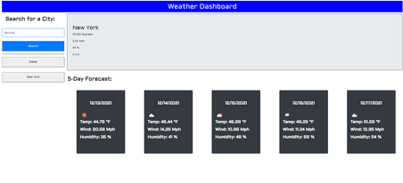
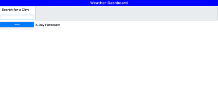
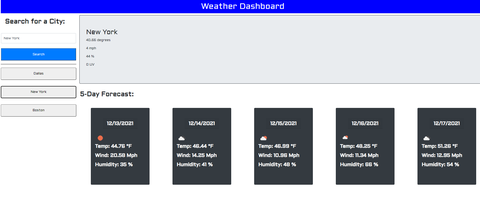

# Forecast-de-Luigi

## Description
This assignment is a Weather Dashboard with Weathermap api implementations via Open Weather Map.

The dashboard generates buttons for your recent history, generating all the information you need about the forecast at the **click of a button!**

## Usage

1. It starts out as a blank page until you decide to put in the city of your choice.

2. After inputting your text, you will then be able to see all the information of the city of your choice.
  - Notice that you can click on the buttons below the search bar to go back to previous searches at the click of a button!
 

### Link
If you would like to try it using this [link, ](https://wingz003.github.io/Forecast-de-Luigi/) you will always be prepared for what ever weather comes your way. 

Thank you very much!
